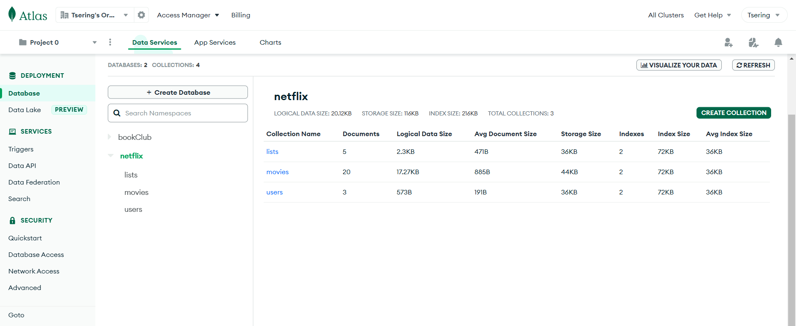

# Netflix-Clone

### *In Development Phase*

A NETFLIX clone app with very similar interface and experience created with MERN Stack (MongoDb, Express, React, NodeJs). The Front end was developed using React, SCSS and Material UI for similar User Experience as original Netflix. And the back end is built with NodeJs, Express, Mongoose and with MongoDB as database.

## Features

- User can navigate tp sign up page, login page, home and movie view page.
- The password when entered are google checked in most basic way
- User can slide thru sections to see more movies.
- User can hover over selection to see more details and a preview.
- The video player is implemented with Vimeo and has most usabilty such as play/pause, full screen and options.

## [Live View](https://netflix-clone-front.onrender.com/)

### MonogoDb Database

## Technologies

- React (Frontend View Framework)
- SCSS
- Material UI
- React Hooks (useState, useEffect)
- SPA (Single Page Application, Routers, Routes)
- MongoDB
- CSS (styling the app)
- CSS Material UI Library
- Node (npm)
